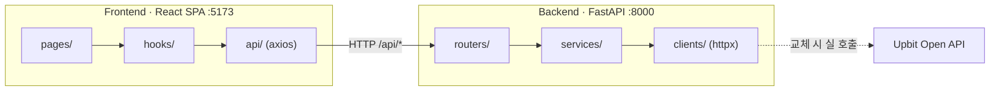

# UPquant

> 업비트(Upbit) KRW 마켓 암호화폐 분석 대시보드 — **POC**

업비트 KRW 마켓의 시세·호가·체결·캔들 데이터를 한 화면에서 탐색하고, 카테고리별 수익률 분석부터 **종목 비교 · 전략 백테스트 · 조건 스크리닝**까지 제공하는 대시보드입니다. 현재 백엔드는 결정론적 **더미 데이터**로 동작하며, 외부 API 클라이언트 한 곳만 교체하면 실제 업비트 Open API로 전환되도록 설계되어 있습니다.

<p>
  
  
  
  
  
</p>

---

## 목차

- [화면 구성](#화면-구성)
- [기술 스택](#기술-스택)
- [아키텍처](#아키텍처)
- [프로젝트 구조](#프로젝트-구조)
- [시작하기](#시작하기)
- [API 레퍼런스](#api-레퍼런스)
- [데이터 모델](#데이터-모델)
- [설계 노트](#설계-노트)
- [현재 상태 & 로드맵](#현재-상태--로드맵)

---

## 화면 구성

헤더 탭 6개 + 코인 상세(하위 라우트), 총 7개 라우트로 구성된 SPA입니다.

| 경로 | 페이지 | 설명 | 참고 스타일 |
|------|--------|------|------------|
| `/` | **Dashboard** (대시보드) | KPI 카드 · 카테고리 누적수익률 라인차트 · 월별 수익률 히트맵 · 리스크-수익 산점도 | Finviz |
| `/market` | **Market** (마켓 현황) | 미니 차트 카드 · 상승률 테이블 · 거래대금 트리맵 | — |
| `/coins` | **CoinList** (코인 목록) | 시장 요약 카드 · 검색 · 코인 테이블(스파크라인) | CoinGecko |
| `/coins/:market` | **CoinDetail** (코인 상세) | 캔들차트 · 실시간 호가창 · 체결 내역 | Upbit |
| `/compare` | **Compare** (비교 분석) | 최대 5종목 선택 · 90일 누적 등락률 라인 비교 · 종목별 통계 카드 | — |
| `/backtest` | **Backtest** (백테스트) | MA 크로스 / RSI 역추세 전략 · 자산 곡선 · 성과지표(수익률·MDD·승률) · 거래 내역 | — |
| `/screener` | **Screener** (스크리너) | 다중 조건 필터(등락률·거래대금·변동성·1개월 수익률·52주 위치) · 프리셋 | — |

---

## 기술 스택

### Backend (Python)

| 라이브러리 | 용도 |
|-----------|------|
| **FastAPI** | REST API 서버 |
| **httpx** | 업비트 REST 클라이언트 (async) |
| **pydantic / pydantic-settings** | 응답 스키마(DTO) · 환경설정 |
| **uvicorn** | ASGI 서버 |

### Frontend (Node)

| 라이브러리 | 용도 |
|-----------|------|
| **React 19 + Vite** | UI 프레임워크 · 번들러 (JavaScript) |
| **react-router-dom v7** | 클라이언트 사이드 라우팅 |
| **axios** | HTTP 클라이언트 |
| **recharts v3** | 분석 차트 (라인 · 산점도 · 트리맵 · 스파크라인) |
| **lightweight-charts v5** | 캔들차트 (CoinDetail) |
| **Tailwind CSS v4** | 스타일링 (`@tailwindcss/vite`) |

---

## 아키텍처

프론트엔드(SPA)와 백엔드(REST API)가 분리된 모노레포이며, 각 레이어는 단방향으로 의존합니다.



**Backend 레이어** — Spring과 유사한 계층 구조

```
routers/   ← HTTP 진입점          (≈ @RestController)
   ↓
services/  ← 비즈니스 로직         (≈ @Service)  ※ 현재 더미 데이터 생성
   ↓
clients/   ← 외부 API 호출 래퍼    (≈ @Repository)
```

**Frontend 레이어**

```
pages/     ← 라우트별 화면
   ↓
hooks/     ← 데이터 페칭 + 상태 관리
   ↓
api/       ← axios HTTP 호출
```

---

## 프로젝트 구조

```
up-quant/
├── backend/                       # FastAPI 서버
│   ├── app/
│   │   ├── main.py                # 앱 진입점 · CORS · 라우터 등록 · /health
│   │   ├── core/
│   │   │   ├── config.py          # pydantic-settings 환경설정
│   │   │   └── cache.py           # TTL 인메모리 캐시 (실 API 전환 대비)
│   │   ├── clients/
│   │   │   └── upbit_rest.py      # 업비트 REST 클라이언트 (httpx async)
│   │   ├── schemas/               # Pydantic 응답 모델
│   │   │   ├── market.py          # Ticker · MarketSummary · Orderbook · Trade
│   │   │   ├── candle.py          # CandleItem
│   │   │   ├── analysis.py        # CategoryMonthly · CoinStat
│   │   │   └── backtest.py        # EquityPoint · TradeRecord · BacktestMetrics · BacktestResult
│   │   ├── services/              # 비즈니스 로직 (현재 더미 데이터 생성)
│   │   │   ├── market_service.py
│   │   │   ├── candle_service.py
│   │   │   ├── analysis_service.py
│   │   │   └── backtest_service.py # MA 크로스 · RSI 전략, SMA/RSI/MDD 계산
│   │   └── routers/               # HTTP 엔드포인트
│   │       ├── markets.py
│   │       ├── candles.py
│   │       ├── analysis.py
│   │       └── backtest.py
│   └── requirements.txt
├── frontend/                      # React + Vite SPA
│   ├── src/
│   │   ├── main.jsx               # 진입점
│   │   ├── App.jsx                # 라우트 정의
│   │   ├── index.css              # Tailwind 엔트리
│   │   ├── api/                   # axios 호출 래퍼
│   │   │   ├── client.js          # axios 인스턴스 (baseURL)
│   │   │   ├── markets.js
│   │   │   ├── candles.js
│   │   │   ├── analysis.js
│   │   │   └── backtest.js
│   │   ├── hooks/                 # 데이터 페칭 훅
│   │   │   ├── useTickers.js
│   │   │   ├── useCandles.js
│   │   │   └── useAnalysis.js
│   │   ├── components/
│   │   │   └── layout/            # Header · Layout
│   │   └── pages/                 # 라우트별 페이지
│   │       ├── Dashboard.jsx
│   │       ├── Market.jsx
│   │       ├── CoinList.jsx
│   │       ├── CoinDetail.jsx
│   │       ├── Compare.jsx
│   │       ├── Backtest.jsx
│   │       └── Screener.jsx
│   ├── index.html
│   ├── vite.config.js
│   ├── eslint.config.js
│   └── package.json
└── references/                    # 기획서 · 레퍼런스 이미지
```

---

## 시작하기

### 사전 요구사항

- **Python** 3.11+
- **Node.js** 18+ (권장: 20+)

### Backend

```powershell
cd backend
python -m venv .venv
.\.venv\Scripts\Activate.ps1
pip install -r requirements.txt
fastapi dev app/main.py
```

→ API 서버: <http://localhost:8000>
→ Swagger 문서: <http://localhost:8000/docs>

> macOS / Linux는 `source .venv/bin/activate`로 가상환경을 활성화합니다.

### Frontend

```bash
cd frontend
npm install
npm run dev
```

→ 개발 서버: <http://localhost:5173>

> 프론트엔드는 `http://localhost:8000`을 백엔드로 호출하며, 백엔드 CORS는 `http://localhost:5173`을 허용합니다. 두 서버를 함께 실행해야 합니다.

#### 사용 가능한 스크립트 (frontend)

| 명령 | 설명 |
|------|------|
| `npm run dev` | 개발 서버 (HMR) |
| `npm run build` | 프로덕션 빌드 |
| `npm run preview` | 빌드 결과 미리보기 |
| `npm run lint` | ESLint 검사 |

---

## API 레퍼런스

기본 URL: `http://localhost:8000` · 전 엔드포인트 인증 불필요 (공개 시세)

### Health

| Method | Path | 설명 |
|--------|------|------|
| `GET` | `/health` | 헬스 체크 → `{ "status": "ok" }` |

### Markets — `/api/markets`

| Method | Path | 응답 모델 | 설명 |
|--------|------|-----------|------|
| `GET` | `/tickers` | `Ticker[]` | 전체 코인 현재가 목록 |
| `GET` | `/tickers/{market}` | `Ticker` | 단일 코인 현재가 (없으면 404) |
| `GET` | `/summary` | `MarketSummary` | 시장 요약 (거래대금·상승/하락 수·BTC 도미넌스) |
| `GET` | `/orderbook/{market}` | `Orderbook` | 호가창 (매도/매수 각 8호가) |
| `GET` | `/trades/{market}` | `Trade[]` | 최근 체결 내역 (20건) |

### Candles — `/api/candles`

| Method | Path | 쿼리 파라미터 | 응답 모델 | 설명 |
|--------|------|--------------|-----------|------|
| `GET` | `/{market}` | `interval=days` · `count=60` | `CandleItem[]` | 캔들 데이터 (`interval`: `minutes` \| `days` \| `weeks`) |

### Analysis — `/api/analysis`

| Method | Path | 응답 모델 | 설명 |
|--------|------|-----------|------|
| `GET` | `/category/monthly` | `CategoryMonthly[]` | 카테고리별 월간 수익률 |
| `GET` | `/category/cumulative` | `CategoryMonthly[]` | 카테고리별 누적 수익률 |
| `GET` | `/coins` | `CoinStat[]` | 코인별 변동성·1개월 수익률 (리스크-수익 산점도용) |

### Backtest — `/api/backtest`

일봉 캔들 기준 전략 시뮬레이션. 초기 자본 100으로 단일 종목 롱 포지션을 매매합니다.

| Method | Path | 쿼리 파라미터 | 응답 모델 | 설명 |
|--------|------|--------------|-----------|------|
| `GET` | `/ma-cross` | `market=KRW-BTC` · `fast=5` · `slow=20` · `count=200` | `BacktestResult` | 이동평균 골든/데드크로스 전략 |
| `GET` | `/rsi` | `market=KRW-BTC` · `period=14` · `oversold=30` · `overbought=70` · `count=200` | `BacktestResult` | RSI 과매도 매수 / 과매수 매도 역추세 전략 |

---

## 데이터 모델

주요 Pydantic 응답 스키마입니다. (`backend/app/schemas/`)

<details>
<summary><b>Ticker</b> — 현재가</summary>

| 필드 | 타입 | 설명 |
|------|------|------|
| `market` | `str` | 마켓 코드 (예: `KRW-BTC`) |
| `korean_name` | `str` | 한글명 |
| `trade_price` | `float` | 현재가 |
| `change` | `str` | `RISE` \| `FALL` \| `EVEN` |
| `change_rate` | `float` | 전일 대비 변동률 |
| `change_price` | `float` | 전일 대비 변동액 |
| `acc_trade_price_24h` | `float` | 24h 누적 거래대금 |
| `high_price` / `low_price` | `float` | 고가 / 저가 |
| `prev_closing_price` | `float` | 전일 종가 |
| `sparkline` | `float[]` | 미니 차트용 가격 배열 |
| `is_52w_high` / `is_52w_low` | `bool` | 52주 신고가 / 신저가 여부 |
| `w52_high` / `w52_low` | `float` | 52주 최고가 / 최저가 |

</details>

<details>
<summary><b>MarketSummary</b> · <b>Orderbook</b> · <b>Trade</b></summary>

```text
MarketSummary { total_volume, up_count, down_count, btc_dominance }
Orderbook     { market, asks: OrderbookUnit[], bids: OrderbookUnit[] }
OrderbookUnit { price, size }
Trade         { timestamp, price, volume, side(BID|ASK) }
```

</details>

<details>
<summary><b>CandleItem</b> · <b>CategoryMonthly</b> · <b>CoinStat</b></summary>

```text
CandleItem      { timestamp(ms), open, high, low, close, volume }
CategoryMonthly { month("YYYY-MM"), layer1, defi, meme, gaming, layer2 }
CoinStat        { market, korean_name, category, volatility(%), return_1m(%), acc_trade_price_24h }
```

코인은 `layer1` · `defi` · `meme` · `gaming` · `layer2` 카테고리로 분류됩니다.

</details>

<details>
<summary><b>BacktestResult</b> — 백테스트 결과</summary>

```text
BacktestResult  { equity: EquityPoint[], trades: TradeRecord[], metrics: BacktestMetrics }
EquityPoint     { time(s), value }              # 초기 100 기준 포트폴리오 가치
TradeRecord     { time(s), side(BUY|SELL), price, pnl(%) }
BacktestMetrics { total_return(%), mdd(%), win_rate(%), trade_count }
```

</details>

---

## 설계 노트

| 항목 | 선택 | 사유 |
|------|------|------|
| 더미 데이터 위치 | `services/` 레이어에서 생성 | `clients/upbit_rest.py` 호출로 교체만 하면 실 API 전환 |
| 데이터 결정성 | `market`/`interval` 시드 기반 난수 | 재실행해도 동일한 차트·스파크라인 보장 |
| 라우터 prefix | `/api/markets` 등 플랫 구조 | `api/v1/` 버저닝은 POC 단계에서 생략 |
| 색상 컨벤션 | 상승 = 빨강 / 하락 = 파랑 | 한국 금융 UI 관행 |
| 헤더 색상 | `#093687` 네이비 | 업비트 헤더 톤 매칭 |
| 캔들차트 | lightweight-charts v5 | `addSeries(CandlestickSeries, opts)` API |
| 분석 지표 | 업비트 Open API로 계산 가능한 것만 | 더미 → 실 전환 시 호환 보장 |
| 백테스트 입력 | `candle_service`의 일봉 캔들 재사용 | 별도 데이터 소스 없이 전략 검증 |
| 실시간성 | 현재 HTTP, WebSocket은 추후 | POC는 폴링으로 충분 |

> 업비트 Open API: REST `https://api.upbit.com/v1`, WebSocket `wss://api.upbit.com/websocket/v1`. 공개 시세는 인증 불필요 (REST 분당 약 600회 제한).

---

## 현재 상태 & 로드맵

> 🚧 **POC 단계** — 모든 API 응답은 현재 결정론적 더미 데이터입니다.

**완료**
- [x] 백엔드 4개 라우터 (markets / candles / analysis / backtest) + 응답 스키마
- [x] 15개 KRW 코인 더미 데이터 · 결정론적 캔들/스파크라인 · 52주 고저
- [x] 카테고리 월별·누적 수익률, 변동성·1개월 수익률 계산
- [x] MA 크로스 / RSI 백테스트 엔진 (자산 곡선·MDD·승률)
- [x] 프론트 7개 페이지 (대시보드·마켓·코인목록·코인상세·비교분석·백테스트·스크리너) + 데이터 페칭 훅

**다음 작업**
- [ ] 실 업비트 API 연결 (`upbit_rest.py` + `cache.py` 활용, 서비스 레이어 교체)
- [ ] WebSocket 실시간 시세 중계 (FastAPI WS → 프론트 Context)
- [ ] CoinDetail 캔들 인터벌 탭 (분봉/일봉/주봉 — 백엔드 API는 준비됨)
- [ ] 에러/로딩 상태 UI 개선

**의도적으로 보류** (POC 이후): Redis 캐싱 · TypeScript 마이그레이션 · 테스트 코드 · 다크모드 · 배포 설정
