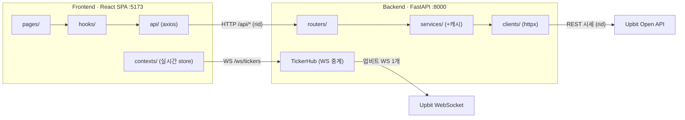

# UPquant

> **암호화폐 퀀트 분석 대시보드**

UPquant는 업비트 KRW 마켓에 상장된 암호화폐 **약 260종 전체**를 업비트 Open API와 데이터랩 웹스크래핑으로 수집해 **퀀트 트레이딩의 의사결정 흐름**(① 시장 국면 → ② 자산 구조·리스크 → ③ 팩터·전략 → ④ 포트폴리오 → ⑤ 백테스트 검증)대로 한 화면에서 정량 분석하는 웹 대시보드입니다.

단순 시세 조회를 넘어 **상관분석·PCA·군집·GARCH·HMM·공적분·평균-분산 최적화·모멘텀 팩터·VaR** 등 9가지 정량 기법을 각 기법의 고전 선행연구(Markowitz, Engle, Hamilton, Mantegna, Jegadeesh-Titman 등)에 기반해 구현하고 하나의 의사결정 흐름으로 연결한 것이 핵심입니다.


<p>
  
  
  
  
  
  
</p>

---

## 목차

- [무엇을 답하는가](#무엇을-답하는가)
- [분석 프레임워크](#분석-프레임워크)
- [화면 구성](#화면-구성)
- [기술 스택](#기술-스택)
- [아키텍처](#아키텍처)
- [데이터 소스](#데이터-소스)
- [프로젝트 구조](#프로젝트-구조)
- [시작하기](#시작하기)
- [API 레퍼런스](#api-레퍼런스)
- [설계 노트](#설계-노트)

---

## 무엇을 답하는가

암호화폐는 분석하기 까다로운 자산군입니다.

- **변동성이 매우 큽니다** — 하루에도 크게 출렁입니다.
- **자산 간 상관이 높습니다** — 대부분의 코인이 비트코인을 따라 함께 움직여 분산투자 효과가 제한적입니다.
- **24시간 쉬지 않고 거래됩니다** — 장 마감이 없습니다.
- **정보가 흩어져 있습니다** — 시세·분류·리스크·전략 검증이 서로 다른 곳에 따로 있습니다.

그래서 개인이 정량적으로 판단하기가 어렵습니다. UPquant의 **연구 질문**은 이것입니다:

> *"암호화폐 시장에서 퀀트 트레이더가 던지는 의사결정 질문 — 지금 시장 국면은 어떤가, 분산은 되는가, 어떤 팩터가 통하는가, 최적 비중은 무엇이며, 그 전략이 거래비용 후에도 수익이 나는가 — 를 **하나의 데이터 파이프라인**으로 답할 수 있는가?"*

UPquant는 이 흩어진 분석을 **다섯 단계의 의사결정 흐름**으로 통합합니다.

```
① 시장 국면        ② 자산 구조·리스크       ③ 팩터·전략          ④ 포트폴리오         ⑤ 검증
   지금 시장이          분산이 실제로            수익 팩터가          최적 비중은            전략이 거래비용
   평온/격동 중       되는가? 무엇이 함께        실재하는가?           무엇인가?            후에도 돈이 되나?
   어디인가?          움직이는가?
   ──────────         ──────────              ──────────           ──────────           ──────────
   HMM 국면           상관 네트워크·PCA·       모멘텀 팩터·          Markowitz            백테스트
   변동성 군집         K-means 군집            공적분 페어           효율적 경계선         (거래비용·알파·워크포워드)
```

---

## 분석 프레임워크

> 이 프로젝트의 정체성. **9가지 정량 기법**을 퀀트 의사결정 흐름으로 엮고, 각각을 고전 선행연구에 기반해 구현했습니다.

### 의사결정 흐름 × 기능 × 이론 × 인사이트

| 퀀트의 질문 | 대시보드 기능 (경로) | 금융·경제 이론 | 유의미한 결과 |
|---|---|---|---|
| **① 지금 시장 국면은?** | HMM 국면 탐지 (`/research/regime`) | 레짐 스위칭, 변동성 군집(ARCH 효과) | 평온/격동 국면 자동 라벨 → 리스크 온·오프·포지션 사이징 |
| **② 분산이 실제로 되나?** | 상관 네트워크(MST) · PCA · K-means 군집 (`/research/structure`·`/research/regime`) | 체계적 위험 vs 고유 위험, 시장 베타 | PC1(공통요인) 설명력이 커 한 덩어리로 움직임 → **분산효과 제한적**, 허브(BTC) 식별 |
| **③ 어느 섹터로 자금이?** | 섹터 누적수익률 · 로테이션 (`/market/sectors`) | 섹터 로테이션, 테마 모멘텀 | 강·약 섹터로 자금 흐름 방향 파악 |
| **④ 수익 팩터가 실재하나?** | 횡단면 모멘텀 롱숏 백테스트 (`/research/factor`) | 팩터 투자, 시장 효율성 | 모멘텀 분위 롱숏 성과 → 크립토 모멘텀 유효성 검증 |
| **⑤ 차익거래 기회는?** | 공적분 페어트레이딩 (`/research/factor`) | 공적분·평균회귀, 시장중립 | 동일 생태계 페어 스프레드 z-점수 → 진입 신호 |
| **⑥ 최적 비중은?** | Markowitz 효율적 경계선 (`/strategy/portfolio`) | 현대 포트폴리오 이론(MPT), 평균-분산, 샤프 | ★최대샤프 / ◆최소분산 비중 산출, 분산효과 곡선 |
| **⑦ 얼마나 잃을 수 있나?** | GARCH 변동성예측 · VaR (`/research/risk`, 코인 상세) | GARCH 변동성, Value-at-Risk | 1일 95% VaR로 하방 위험 정량화 |
| **⑧ 전략이 진짜 돈이 되나?** | 백테스트 (거래비용·벤치마크·알파·워크포워드) (`/strategy/backtest`) | 초과수익(알파), 거래비용, 생존편향 | 거래비용 차감 후에도 buy&hold 대비 알파가 남는가 |

### 분석 기법 ↔ 선행연구

| 기법 | 선행연구 / 이론 |
|---|---|
| 포트폴리오 최적화 | Markowitz (1952) — 평균-분산, 효율적 경계선 |
| 변동성 · VaR | Engle (1982) ARCH / Bollerslev (1986) GARCH, Value-at-Risk |
| 시장 국면 | Hamilton (1989) — 레짐 스위칭, Gaussian HMM |
| 상관 네트워크 | Mantegna (1999) — 최소신장트리(MST) 시장구조 |
| 시장요인 (PCA) | 주성분분석 / CAPM 체계적 위험·베타 |
| 모멘텀 팩터 | Jegadeesh & Titman (1993), Fama-French 팩터 모형 |
| 추세추종 (시계열 모멘텀) | Moskowitz·Ooi·Pedersen (2012) TSMOM, Daniel·Moskowitz (2016) 모멘텀 크래시 |
| 변동성 타게팅 | Barroso·Santa-Clara (2015), Moreira·Muir (2017) — 변동성 스케일링 |
| 공분산 추정 · 분산 | Ledoit·Wolf (2004) 수축 공분산 · 리스크 패리티 |
| 꼬리 리스크 | Historical VaR / CVaR(기대손실) — 경험분위 팻테일 반영 |
| 과최적화 검증 | 워크포워드 · 다중검정 보정(귀무 분포 대비) · 몬테카를로 부트스트랩 |
| 페어트레이딩 | Engle-Granger (1987) — 공적분, 평균회귀 |

> **방침**: 검증된 통계/ML은 라이브러리(numpy·scipy·scikit-learn·statsmodels·arch·hmmlearn·networkx)로 구현하고, 직접 구현의 정체성은 캐시·로깅·실시간 중계·API 계층에 둡니다. 예측형보다 **구조·리스크 분석**에 무게를 둡니다.

---

## 화면 구성

헤더 탭을 **자산운용 리서치 톤**(증권사·운용사 용어)으로 묶은 SPA입니다 — **시장 동향** │ **마켓▾**(시장 현황·섹터·스크리너·종목 비교) │ **리서치▾**(시장 구조·시장 국면·팩터·리스크) │ ⎟관점 구분선⎟ │ **최적화** │ **백테스트▾**(MA·RSI·추세추종·포트폴리오) │ **검증**(3기법 한 페이지) │ **AI 전략**(βeta·Gemini 모달). 드롭다운 그룹명 = 경로 prefix(`/market/*`·`/research/*`·`/strategy/*`)이고, 가운데 구분선은 **분석(시장 동향·마켓·리서치) │ 실행(최적화·백테스트·검증)** 단계 경계를 나타냅니다. 종목 비교·스크리너는 "탐색"(발굴한 후보를 겹쳐 보기/전체 시장 발굴)이라 마켓에 둡니다. 로고(`/`)는 **코인 목록**(master-detail)이며, 도움말·가이드는 별도 창입니다. 헤더 우측에 **가격 알림(🔔, 실시간 조건 도달 시 토스트) · 다크모드 토글 · 더보기(시스템 모니터링·실시간 상태·가이드·도움말·로그아웃)**가 있습니다. 드롭다운으로 들어간 페이지(마켓·리서치·백테스트 하위)는 본문 최상단에 **`그룹 › 페이지` 브레드크럼**을 표시합니다. **표시형 페이지는 로딩/에러 시 헤더·푸터만 남기고 전체가 로딩/에러 화면이 됩니다(부분 렌더 없음).**

| 경로 | 페이지 | 설명 |
|------|--------|------|
| `/` · `/coins` · `/coins/:market` | **코인 목록** (메인, master-detail) | 좌: 코인 상세(캔들 인터벌 10종·MA/Bollinger/RSI 토글·호가·체결·상관관계·GARCH/VaR·거래대금 순위·호가 압력 바) / 우: 슬림 사이드바(검색·필터·정렬·★ 즐겨찾기). **현재가·호가·체결 실시간(WS)** |
| `/trends` | **시장 동향 (코인동향 미러)** | 오늘의 시황 + 최신 뉴스(상단) · 자체 시장지수 6카드(호버 툴팁) + 당일/전일 인트라데이(60분봉) · 주간 상승 TOP10 · **환율 추이 차트**(통화별 X/Y축) · 랭킹 그리드(급상승·급하락·거래량급증·**체결강도**) · 디지털 자산 표(기간수익/시가총액) · 자산 지수 표(시장·전략·테마·섹터). 좌(지수·환율·시그널)/우 레일(TOP10·랭킹 균등분배) 2-컬럼 |
| `/market/overview` · `/market/sectors` · `/market/screener` · `/market/compare` | **마켓** | 현황: 요약 스트립·미니카드·52주 배지·상승/하락/거래대금 표(실시간)·트리맵·산점도·**A-D 라인** / 섹터: 안내(드릴다운)·누적·히트맵 / 스크리너: 다중조건·프리셋·CSV / 종목 비교: 최대 5종 누적등락(PNG·공유링크) |
| `/research/structure` · `/research/regime` · `/research/factor` · `/research/risk` | **리서치** | 시장 구조(MST·K-means 군집) · 시장 국면(PCA·HMM) · 팩터(모멘텀 롱숏·공적분 페어) · 리스크(분포·VaR) |
| `/strategy/portfolio` | **최적화** | Markowitz 효율적 경계선(구름 + 곡선 + ★최대샤프/◆최소분산/**▲리스크패리티**, **Ledoit-Wolf 수축**) + CAL·목표수익률 슬라이더·상관행렬, → 백테스트로 비중 전달 |
| `/strategy/backtest/:strategy` | **백테스트** (헤더 드롭다운) | MA크로스·RSI·**추세추종(TSMOM)**·**포트폴리오 보유** — 전략별 하위 라우트. **유동성 슬리피지**·buy&hold/BTC 벤치마크·알파·Sharpe/Sortino/Calmar |
| `/strategy/validation` | **검증·시뮬레이션** (3기법 한 페이지) | **전략 비교** · **워크포워드**(다중검정 과최적화 p값) · **몬테카를로**(부트스트랩 부채꼴) |
| `/system` | **시스템 모니터링** | 캐시 적중률 · 외부 호출수 · 평균 응답시간 · 최근 요청(rid) · 외부소스 헬스 — 자체 구현 메트릭(⋯ 메뉴) |
| `/help` · `/guide` | **도움말 · 가이드** | 기능 안내 · 방법론/기술스택(**실제 화면 캡처**) — 별도 창 |

> 헤더 그룹명 = 경로 prefix(`/market/*`·`/research/*`·`/strategy/*`), 시황→**시장 동향(`/trends`)**. 옛/평탄 경로(`/dashboard`·`/market`·`/structure`·`/tools/*` 등)는 전부 리다이렉트로 호환.

---

## 기술 스택

### Backend (Python · FastAPI)

| 라이브러리 | 용도 |
|-----------|------|
| **FastAPI · uvicorn** | REST API + WebSocket · ASGI 서버 · 인바운드 로깅 미들웨어 |
| **httpx** | 업비트 REST 클라이언트 (동기 + 전역 스로틀 · 429 재시도 · `event_hooks` 로깅) |
| **websockets** | 업비트 WebSocket 중계 (실시간 시세·호가·체결) |
| **pydantic / pydantic-settings** | 응답 스키마(DTO) · 환경설정 |
| **numpy · pandas · scipy** | 수치 계산 · 수익률 행렬 · 최적화(SLSQP) |
| **scikit-learn** | PCA · K-means · 표준화 |
| **statsmodels** | 공적분 검정(Engle-Granger) · OLS 헤지비율 |
| **arch** | GARCH(1,1) 변동성 예측 · VaR |
| **hmmlearn** | 가우시안 HMM 시장 국면 탐지 |
| **networkx** | 상관 네트워크 최소신장트리(MST) |
| **PyJWT · bcrypt · python-multipart** | 인증 — OAuth2 Password 플로우 + JWT(HttpOnly 쿠키) · 비밀번호 해싱 |

> 외부 의존성 없는 인메모리 TTL 캐시(`core/cache.py`, stale-while-revalidate · single-flight · 포그라운드 우선 스로틀), `contextvars` 기반 요청 ID 로깅(`core/logging.py`), 업비트 WS 중계 허브(`main.py:TickerHub`), **JWT 인증(`core/security.py`) + 레이트리밋(`core/ratelimit.py`)**을 자체 구현했습니다. WS는 `certifi` 기반 SSL 컨텍스트로 TLS를 검증합니다. 모든 `/api/*`·`/ws/*`는 로그인 가드(`Depends(current_user)`) 뒤에 있습니다. 수치 코어·캐시·설정·라우터·인증은 `pytest`(`backend/tests/`, 43개)로 검증하며 GitHub Actions CI에서 백엔드 테스트 + 프론트 lint·typecheck·**vitest**·build를 돌립니다.

### Frontend (Node · React 19 + Vite + TypeScript)

| 라이브러리 | 용도 |
|-----------|------|
| **React 19 + Vite** | UI 프레임워크 · 번들러 |
| **TypeScript** | 전 소스 `.ts/.tsx` · **strict 전면 활성화**(noImplicitAny·strictNullChecks 포함) · 백엔드 스키마 거울 `types.ts`(도메인 모델 실타입) · `tsc --noEmit` · 코드 스플리팅(`React.lazy`) |
| **react-router-dom v7** | 클라이언트 사이드 라우팅 (인증 게이트) |
| **@tanstack/react-query** | 서버 상태 캐시 (동일키 디둡 · staleTime · keepPreviousData) |
| **axios** | HTTP 클라이언트 (요청 ID 인터셉터 · 쿠키 인증 · 401 갱신) |
| **recharts v3** | 분석 차트 (라인 · 산점도 · 트리맵 · 스파크라인 · 효율적 경계선) |
| **lightweight-charts v5** | 캔들차트 (코인 상세) |
| **d3-force** | 상관 네트워크 force 레이아웃 |
| **Tailwind CSS v4** | 스타일링 (`@tailwindcss/vite`, `@theme` 색 토큰) |
| **vitest + Testing Library** | 프론트 단위 테스트 (`npm run test`) |

> 실시간 시세는 `useSyncExternalStore` 기반 **외부 store + 종목별 selector**로 구독해, 261종이 고빈도로 갱신돼도 바뀐 종목의 셀만 리렌더합니다(Context 전체 구독의 리렌더 폭주 회피).

---

## 아키텍처

프론트엔드(SPA)와 백엔드(REST API + WebSocket)가 분리된 모노레포이며, 각 레이어는 단방향으로 의존합니다.



**Backend 레이어**

```
routers/   ← HTTP/WS 진입점        (≈ @RestController)
   ↓
services/  ← 비즈니스 로직 + 캐싱   (≈ @Service)  ※ 업비트 응답을 가공·캐시
   ↓
clients/   ← 외부 API 호출 래퍼    (≈ @Repository)  ※ 스로틀·재시도·로깅
```

- **정량 분석**(`quant_service.py`)은 별도 데이터를 받지 않고 **공용 일봉 캐시를 재사용**합니다(`returns_matrix` 헬퍼 → 추가 팬아웃 0, 계산만).
- **실시간 중계**(`main.py:TickerHub`)는 업비트 ticker WebSocket을 **단 1개**만 열어 모든 클라이언트에 fan-out합니다. REST 캐시의 "대량 팬아웃은 1회만, 이후 공유" 원칙을 WebSocket으로 옮긴 것입니다.

**관측성(Observability)** — 프론트 axios 인터셉터 → 백엔드 미들웨어 → 업비트 `event_hook`이 모두 동일한 **요청 ID(rid)** 로 로깅됩니다. 백엔드가 `X-Request-Id` 헤더로 rid를 내려주며, 한 요청의 전 구간을 grep 한 번으로 추적할 수 있습니다.

---

## 데이터 소스

**공개 API와 웹스크래핑을 결합**해 시세·분류·리스크를 한 흐름으로 해석합니다.

| 데이터 | 수집 방식 | 가져온 데이터 | 활용 |
|---|---|---|---|
| **업비트 시세 Open API** | 공개 REST/WebSocket (인증 불필요) | 현재가·캔들·호가·체결·52주·**체결강도(WS `acc_ask/bid_volume`)** (약 260종) | 시세·차트·리스크·정량분석·트렌드 전반 |
| **업비트 데이터랩 '코인 분류'** | 웹 스크래핑 (1회, 정적 스냅샷) | 약 260종 섹터(대분류 5)·테마(level2) | 섹터·테마 성과·분류 |
| **환율** (현재가 open.er-api.com · **추이 frankfurter.dev**) | 외부 무료 API 2종 (백엔드 프록시·캐시) | USD·JPY·CNY·EUR / KRW 현재가 + 최근 ~32영업일 시계열(ECB 일별) | 트렌드 대시보드 '환율' — 통화별 추이 라인차트 |
| **뉴스** (한국 크립토 RSS) | 외부 RSS 통합 (블록미디어·토큰포스트·블록체인투데이, 헤드라인+링크만) | 최신 기사 제목·링크 | 트렌드 대시보드 '최신 뉴스' |
| **시가총액 · 도미넌스** (CoinGecko) | 외부 무료 API (`/coins/markets` 상위 500 · `/global`) | 시총·순위 · **BTC 시총 도미넌스** | '시가총액' 탭 · 시황 도미넌스(시총 기준, 실패 시 거래대금 비중 폴백) |
| **공포·탐욕** (alternative.me) | 외부 무료 API | Crypto Fear & Greed Index | 시장 요약(실패 시 자체 시장 폭 프록시 폴백·출처 표시) |

- **분석 유니버스 = KRW 마켓 전체**(약 261종, `config.USE_ALL_KRW_MARKETS`). 부팅 시 `/market/all`과 교집합만 사용해 상장폐지 종목을 자동 제외합니다(예: MATIC → POL).
- 시세 API는 코인의 카테고리를 주지 않으므로, 데이터랩 '코인 분류' 페이지(Next.js RSC 페이로드)를 **1회 스크랩**해 정적 스냅샷(`upbit_sectors.json`)으로 보관합니다 — **5개 대분류**: `스마트 컨트랙트 플랫폼` · `인프라` · `디파이` · `문화/엔터테인먼트` · `밈`.
- 섹터 수익률은 더미가 아닌 **실데이터**입니다(소속 종목의 일봉/월봉 close 동일가중 평균).
- **트렌드 대시보드**는 업비트 '코인동향'을 미러링합니다 — 시장지수는 공식 UBMI가 비공개라 **자체 동일가중 지수**로 대체, 당일/전일 인트라데이는 60분봉 자체 산출. 환율·뉴스·시총만 외부 소스이며 **실패 시 숨기지 않고 "소스 교체 필요"를 노출**합니다.

> 업비트 Open API: REST `https://api.upbit.com/v1`, WebSocket `wss://api.upbit.com/websocket/v1`. 공개 시세는 인증 불필요.

---

## 프로젝트 구조

```
up-quant/
├── backend/                          # FastAPI 서버
│   ├── app/
│   │   ├── main.py                   # 진입점 · CORS(env) · 로깅 미들웨어 · 부팅 프리페치(SKIP_PREFETCH) · 실시간 WS 허브(TickerHub, certifi SSL) · /health(readiness)
│   │   ├── core/
│   │   │   ├── config.py             # 환경설정(CORS_ORIGINS·SKIP_PREFETCH) · 마켓 유니버스/카테고리 · 캐시 TTL
│   │   │   ├── cache.py              # 인메모리 TTL 캐시 (stale-while-revalidate · single-flight)
│   │   │   ├── logging.py            # 요청 ID(rid) contextvar + 공통 로깅 포맷
│   │   │   ├── metrics.py            # 자체 관측성 메트릭 (캐시 적중률·외부 호출·응답시간·최근 rid·소스 상태)
│   │   │   ├── security.py           # OAuth2+JWT(PyJWT·bcrypt) · current_user 의존성 · WS 단발 티켓
│   │   │   └── ratelimit.py          # IP 토큰버킷 레이트리밋 · 로그인 brute-force 잠금
│   │   ├── clients/
│   │   │   └── upbit_rest.py         # 업비트 REST 클라이언트 (httpx · 스로틀 · 429 재시도 · event_hook 로깅)
│   │   ├── data/
│   │   │   └── upbit_sectors.json    # 데이터랩 '코인 분류' 스크랩 스냅샷 (섹터)
│   │   ├── routers/                  # HTTP 엔드포인트 (≈ @RestController)
│   │   │   ├── auth.py               # /api/auth/*     로그인·토큰·갱신·로그아웃·me·WS 티켓
│   │   │   ├── markets.py            # /api/markets/*  현재가·요약·호가·체결
│   │   │   ├── candles.py            # /api/candles/*  캔들
│   │   │   ├── analysis.py           # /api/analysis/* 카테고리·코인통계·상관관계·A-D 라인
│   │   │   ├── backtest.py           # /api/backtest/* MA·RSI·전략비교·워크포워드·몬테카를로·추세추종·포트폴리오
│   │   │   ├── quant.py              # /api/quant/*    정량/ML 9종
│   │   │   ├── report.py             # /api/report/*   AI 전략 리포트(Gemini)
│   │   │   ├── system.py             # /api/system/*   관측성 메트릭
│   │   │   ├── trends.py             # /api/trends/*   코인동향(지수·인트라데이·환율·뉴스·체결강도·시총)
│   │   │   └── signals.py            # /api/signals    모멘텀·페어·국면·돌파 시그널 통합
│   │   ├── services/                 # 비즈니스 로직 + 캐싱 (≈ @Service)
│   │   │   ├── market_service.py     # 현재가·한글명·호가·체결·요약·52주·스파크라인
│   │   │   ├── candle_service.py     # 캔들 (일봉 200개 캐시 후 슬라이스 공유)
│   │   │   ├── analysis_service.py   # 변동성·1개월수익률·상관관계·섹터 수익률·A-D (실데이터)
│   │   │   ├── backtest_service.py   # MA·RSI·전략비교·워크포워드·몬테카를로·TSMOM·포트폴리오 (거래비용·슬리피지·벤치마크)
│   │   │   ├── quant_service.py      # 공용 returns_matrix + Markowitz(경계선)·PCA·군집·덴드로그램·GARCH·HMM·공적분·모멘텀·VaR·리스크패리티
│   │   │   ├── report_service.py     # AI 전략 리포트 (Gemini 실연동·부문별 프롬프트·503 재시도·실패 시 502·차등 캐시)
│   │   │   ├── trends_service.py      # 자체 시장지수·인트라데이·자산지수·체결강도(WS·4초 deadline)·기간수익·시황
│   │   │   ├── fx_service.py          # 환율 프록시 (현재가 open.er-api + 추이 frankfurter.dev, 외부)
│   │   │   ├── news_service.py        # 한국 크립토 RSS 통합 (블록미디어·토큰포스트·블록체인투데이, HTML 가드)
│   │   │   ├── marketcap_service.py   # 시가총액·BTC 도미넌스 (CoinGecko, 외부)
│   │   │   ├── fng_service.py          # 공포·탐욕 지수 (alternative.me, 외부)
│   │   │   └── signal_service.py       # 모멘텀·페어·국면·돌파 시그널 집계
│   │   └── schemas/                  # Pydantic 응답 모델(DTO)
│   │       ├── market.py             # Ticker · MarketSummary · Orderbook · Trade
│   │       ├── candle.py             # CandleItem
│   │       ├── analysis.py           # CategoryReturns · CoinStat · CorrelationItem · AdvanceDeclineResult
│   │       ├── backtest.py           # BacktestResult · StrategyCompareResult · WalkForwardResult · MonteCarloResult · TsmomResult · PortfolioBacktestResult
│   │       ├── quant.py              # PortfolioResult · NetworkResult · PCAResult · GarchResult · RegimeResult …
│   │       ├── report.py             # ReportResult
│   │       ├── trends.py             # MarketIndex · AssetIndices · VolumePower · PeriodReturns · FxResult · NewsResult · MarketBrief
│   │       └── signal.py             # SignalItem · SignalsResult
│   ├── tests/                        # pytest (수치 코어·캐시·설정·라우터·개선 항목)
│   │   ├── test_numeric.py           # MDD·리스크조정·과최적화 p값·피어슨·일간수익률
│   │   ├── test_cache.py             # SWR 콜드/신선/stale 갱신 · single-flight · LRU 읽기 터치
│   │   ├── test_config.py            # CORS_ORIGINS(CSV·JSON)·SKIP_PREFETCH 파싱
│   │   ├── test_quant_units.py       # 페어 OOS 불변식 · 월봉/주봉 canonical 공유
│   │   ├── test_improvements.py      # RSI(Wilder)·변동성 사이징·FDR·2-leg PnL·JWT·레이트리밋·외부 파서
│   │   └── test_routes.py            # /health·메트릭·인증·라우트 등록(네트워크 0)
│   └── requirements.txt
├── frontend/                         # React + Vite SPA (전 소스 TypeScript)
│   ├── src/
│   │   ├── main.tsx                  # 앱 진입점 (ReactDOM · react-query QueryClientProvider)
│   │   ├── App.tsx                   # 라우트 정의(코드 스플리팅) · RequireAuth 게이트 · Auth·Realtime·PriceAlert Provider
│   │   ├── config.ts                 # API_BASE·WS_BASE (VITE_API_BASE·VITE_WS_BASE 환경변수)
│   │   ├── index.css                 # Tailwind 엔트리 + @theme 색 토큰(업비트 블루) · 다크모드 · 실시간 펄스 애니메이션
│   │   ├── theme.ts                  # 구분용 색 팔레트 (SERIES · DOM_COLORS)
│   │   ├── api/                      # axios 호출 래퍼
│   │   │   ├── client.ts             # axios 인스턴스(withCredentials · 401→토큰 갱신 1회→/login) + rid 인터셉터
│   │   │   ├── auth.ts               # 로그인·로그아웃·me·WS 티켓
│   │   │   ├── markets.ts · candles.ts · analysis.ts · backtest.ts · quant.ts · report.ts · system.ts · trends.ts · signals.ts
│   │   ├── hooks/                    # 데이터 페칭 훅 (react-query 백킹 · error/retry)
│   │   │   ├── useFetch.ts           # 공용 단발 fetch (react-query 백킹 · {data,loading,error,retry})
│   │   │   ├── useTickers.ts · useCandles.ts · useAnalysis.ts · useQuant.ts · useTrends.ts · useSignals.ts
│   │   │   ├── useGate.ts            # 표시형 페이지 전역 로딩/에러 게이트 합성
│   │   │   └── useMarketStream.ts    # 코인 상세 호가·체결 실시간 WS(/ws/market/:market)
│   │   ├── contexts/                 # 인증 · 실시간 시세 · 가격 알림
│   │   │   ├── Auth.tsx · useAuth.ts # 로그인 세션(쿠키 JWT) · RequireAuth용 상태
│   │   │   ├── Realtime.tsx          # RealtimeProvider — WS(/ws/tickers) 생명주기 · 300ms 배치
│   │   │   ├── realtimeStore.ts      # 외부 store (종목별 리스너 — useSyncExternalStore)
│   │   │   ├── useRealtime.ts        # useLivePrice · useWsConnected · usePulse
│   │   │   ├── PriceAlerts.tsx       # 가격 알림(실시간 WS 감시 → 토스트, localStorage)
│   │   │   └── usePriceAlerts.ts
│   │   ├── utils/
│   │   │   ├── chartExport.ts        # 차트 SVG→PNG 내보내기
│   │   │   ├── csv.ts                # 시그널 CSV 내보내기
│   │   │   └── format.ts             # 숫자·금액 포맷 헬퍼
│   │   ├── components/
│   │   │   ├── ui/                   # 공용 UI (Spinner · Card · StatCard · PageLoading · PageError)
│   │   │   ├── layout/               # Header(탭 그룹·분석│실행 구분선·🔔·🌙·AI 전략·더보기) · Footer · Layout(+브레드크럼·ErrorBoundary)
│   │   │   ├── LiveCells.tsx         # 실시간 가격/등락 셀 (REST 폴백 + 변동 펄스)
│   │   │   ├── ErrorBoundary.tsx     # 페이지 단위 에러 경계
│   │   │   ├── ReportModal.tsx       # AI 전략 리포트 모달
│   │   │   ├── SignalsPanel.tsx      # 시그널 통합 패널(+CSV 내보내기)
│   │   │   ├── Caveat.tsx            # 백테스트·정량 신뢰성 경고 배지
│   │   │   └── InfoTooltip.tsx       # 제목 옆 ? 호버 안내
│   │   └── pages/                    # 라우트별 페이지
│   │       ├── Login.tsx             # '/login' — 단일 계정 로그인(인트로 연출·인라인 폼)
│   │       ├── CoinList.tsx          # '/' · '/coins' · '/coins/:market' — 메인, master-detail
│   │       ├── CoinDetail.tsx        # 코인 상세 본문(CoinDetailView) — CoinList 좌측에 임베드
│   │       ├── Dashboard.tsx         # '/trends' 시장 동향 — 코인동향 미러(자체지수·인트라데이·환율·뉴스·체결강도·기간수익/시총·자산지수)
│   │       ├── Explore.tsx           # '/market'·'/sectors'·'/screener' 래퍼(URL=서브탭)
│   │       ├── Market.tsx · Sectors.tsx · Screener.tsx   # 탐색 본문 (Explore가 재사용)
│   │       ├── Analysis.tsx          # '/structure'·'/regime'·'/factor'·'/risk' + PortfolioSection
│   │       ├── Tools.tsx             # '/strategy/*'·'/market/compare' 래퍼 (PortfolioPage·BacktestPage·ValidationPage·ComparePage)
│   │       ├── Backtest.tsx          # 전략도구: 백테스트 오케스트레이터
│   │       ├── backtest/             # 백테스트 전략별 본문(Single·Portfolio·Compare·WalkForward·MonteCarlo·Tsmom) + parts·helpers
│   │       ├── Compare.tsx           # 전략도구: 비교 분석 본문 (Tools가 재사용)
│   │       ├── SystemMonitor.tsx     # '/system' — 자체 관측성 메트릭
│   │       ├── Guide.tsx             # '/guide' — 방법론·기술스택 (별도 창)
│   │       └── Help.tsx              # '/help' — 기능 안내 (별도 창)
│   ├── .env.example                  # 배포 환경변수 예시(VITE_API_BASE·VITE_WS_BASE)
│   ├── index.html                    # HTML 엔트리 · Pretendard 폰트 · favicon
│   ├── tsconfig.json                 # TypeScript 설정(strict 전면)
│   ├── vite.config.js · eslint.config.js
│   └── package.json                  # 의존성 · npm 스크립트(dev·build·lint·typecheck)
├── .github/workflows/ci.yml          # CI — 백엔드 compileall+pytest / 프론트 lint+typecheck+build
├── references/                       # 기획서 · API 명세(API.md) · 엔지니어링 노트 · 발표 자료(pt/)
├── CLAUDE.md                         # 협업 규칙 · 구조 · 작업 이력(Phase 0~35)
└── pages.md                          # 페이지 IA 트리 · 중복 진단 · 아이디어 비축 (보조 작업 문서)
```

---

## 시작하기

### 사전 요구사항

- **Python** 3.11+
- **Node.js** 20+ (권장: 22.x)

### Backend

```powershell
cd backend
python -m venv .venv
.\.venv\Scripts\Activate.ps1
pip install -r requirements.txt
fastapi dev app/main.py
```

→ API 서버: <http://localhost:8000> · Swagger 문서: <http://localhost:8000/docs>

> macOS / Linux는 `source .venv/bin/activate`로 가상환경을 활성화합니다.
> 첫 기동 시 부팅 프리페치(동기 워밍)로 수십 초~1분 걸릴 수 있으나, 이후 모든 사용자는 캐시 히트로 콜드 없이 즉시 응답합니다.
> **개발 중**에는 `SKIP_PREFETCH=1 fastapi dev app/main.py`로 워밍을 건너뛰면 리로드마다 대기하지 않습니다(첫 요청만 콜드).

### Frontend

```bash
cd frontend
npm install
npm run dev
```

→ 개발 서버: <http://localhost:5173>

> 프론트엔드는 `http://localhost:8000`을 백엔드로 호출하며(REST + WebSocket), 백엔드 CORS는 `http://localhost:5173`을 허용합니다. **두 서버를 함께 실행**해야 합니다.
> **배포·다른 호스트**에서는 백엔드 주소를 `frontend/.env`의 `VITE_API_BASE`(REST)·`VITE_WS_BASE`(WebSocket, 미지정 시 `VITE_API_BASE`에서 `http→ws` 자동 유도)로 주입합니다(`frontend/.env.example` 참고). 백엔드는 `CORS_ORIGINS` 환경변수로 허용 오리진을 지정합니다.

> **로그인(인증)**: 모든 `/api/*`·`/ws/*`는 로그인을 요구합니다. 첫 화면이 로그인 페이지로, **`test` / `test`** 로 로그인합니다(과제용 하드코딩). 배포 시엔 `AUTH_SECRET`(강한 랜덤)·`COOKIE_SECURE=1`·`CORS_ORIGINS`를 환경변수로 주입하세요. 앱 레벨 레이트리밋은 backstop이며, 실제 DDoS/비용 방어선은 엣지(CloudFront/WAF)입니다.

| 명령 (frontend) | 설명 |
|------|------|
| `npm run dev` | 개발 서버 (HMR) |
| `npm run build` | 프로덕션 빌드 |
| `npm run lint` | ESLint 검사 |
| `npm run typecheck` | TypeScript 타입 검사 (`tsc --noEmit`) |
| `npm run test` | 단위 테스트 (vitest) |

---

## 배포 (AWS · CI/CD)

실서비스: **`https://www.skku.site`**. 프론트(정적)와 백엔드(API+WS)를 분리 호스팅합니다.

```
사용자 ──HTTPS──> CloudFront(ACM) ── S3(up-quant-fe, 정적 FE, OAC)        ← www.skku.site
        ──HTTPS/WSS──> EC2(Nginx+certbot) ── uvicorn(FastAPI, 단일 프로세스) ← api.skku.site
DNS: Route53(skku.site) — www→CloudFront(alias), api→EC2(EIP), apex→www는 CloudFront Function 301
```

- **프론트(S3+CloudFront)**: 빌드 산출물을 S3에 sync, CloudFront가 ACM 인증서로 HTTPS 제공. 원본은 **S3 REST 엔드포인트 + OAC**(웹사이트 엔드포인트 아님 — OAC는 REST에만 적용). SPA 라우팅은 **403/404 → `/index.html`(200)** 커스텀 에러응답. apex(`skku.site`)는 **CloudFront Function으로 www에 301 리다이렉트**.
- **백엔드(EC2 Ubuntu, t3.small)**: ⚠️ **uvicorn 단일 프로세스 systemd**로 실행 — 인메모리 캐시·WebSocket 중계 허브가 프로세스 상태라 멀티워커를 쓰면 캐시·실시간이 깨집니다. Nginx가 `api.skku.site`로 REST·WS를 같은 호스트로 프록시(certbot TLS). 부트스트랩은 [`.github/deploy/setup-ec2.sh`](.github/deploy/setup-ec2.sh)(패키지·스왑·venv·systemd·nginx 일괄).
- **CI/CD(GitHub Actions, 4워크플로)**: `main` 푸시 시 변경된 쪽만 —
  - `ci-frontend`(lint·typecheck·vitest) → 성공 시 `cd-frontend`(빌드→S3 sync→CloudFront 무효화)
  - `ci-backend`(compileall·pytest) → 성공 시 `cd-backend`(EC2 SSH→`git pull`→Secrets로 `.env` 주입→`pip`→`restart`→**헬스 ready 폴링**)
  - CI→CD 연결은 **`workflow_run`**(테스트 통과해야 배포). 비밀은 **GitHub Repository Secrets** 단일 소스(프론트는 빌드타임 `vars.VITE_API_BASE`/`VITE_WS_BASE`).
- **환경변수**: 백엔드 `AUTH_SECRET`·`AUTH_PASSWORD`·`CORS_ORIGINS=https://www.skku.site`·`COOKIE_SECURE=1`·`GEMINI_API_KEY`(CD가 `.env`로 주입). ⚠️ `AUTH_SECRET`은 고정(바뀌면 발급된 JWT 전부 무효 → 전원 로그아웃).

---

## API 레퍼런스

기본 URL: `http://localhost:8000` · **모든 `/api/*`·`/ws/*`는 로그인 인증 필요**(HttpOnly 쿠키 JWT, 과제용 계정 `test`/`test`). 모든 응답에 추적용 `X-Request-Id` 헤더가 포함됩니다. **상세 명세는 [`references/API.md`](references/API.md)** 또는 Swagger(`/docs`)를 참고하세요.

| 그룹 | 주요 엔드포인트 |
|------|-----------------|
| **Markets** `/api/markets` | `/tickers` · `/tickers/{market}` · `/summary` · `/orderbook/{market}` · `/trades/{market}` |
| **Candles** `/api/candles` | `/{market}?interval=days&count=60` (`minutes/{1..240}`·`days`·`weeks`·`months`) |
| **Analysis** `/api/analysis` | `/category/monthly` · `/category/cumulative-daily` · `/coins` · `/correlation/{market}` · `/advance-decline` |
| **Backtest** `/api/backtest` | `/ma-cross` · `/rsi` · `/compare`(전략 비교) · `/walk-forward`(과최적화 검증) · `/montecarlo` · `/tsmom`(추세추종) · `/portfolio` |
| **Quant** `/api/quant` | `/portfolio`(효율적 경계선) · `/network`(MST) · `/pca` · `/clusters` · `/dendrogram` · `/garch/{market}` · `/momentum` · `/pairs`(공적분) · `/regime`(HMM) |
| **Trends** `/api/trends` | `/indices`(자체 시장지수+당일/전일 인트라데이) · `/asset-indices`(시장·전략·테마·섹터) · `/volume-power`(체결강도, WS) · `/period-returns`(기간수익+시총) · `/brief`(시황) · `/fx`(환율·외부) · `/news`(뉴스·외부) |
| **Report / System** | `/api/report/strategy`(AI 전략 리포트) · `/api/system/metrics`(관측성) |
| **WebSocket** `/ws` | `/ws/tickers`(전체 현재가 실시간) · `/ws/market/{market}`(종목 호가·체결 실시간) |
| **Health** | `/health`(status · ready) |

---

## 설계 노트

| 항목 | 선택 | 사유 |
|------|------|------|
| 데이터 소스 | 업비트 시세 REST + WebSocket · 인증 불필요 | 계정/거래 권한 없이 시세만 사용 |
| 인증/보안 | OAuth2+JWT(HttpOnly·SameSite 쿠키) · IP 레이트리밋 · 로그인 brute-force 잠금 · WS 단발 티켓 | 모든 `/api`·`/ws` 보호, 배포(AWS) 시 비용성 남용 방어. 엣지(WAF)가 1차, 앱은 backstop |
| 캐싱 | 인메모리 TTL + stale-while-revalidate + single-flight | 만료 시에도 옛 값 즉시 응답, 갱신은 백그라운드 1스레드만 (콜드·스탬피드 회피) |
| 일봉 캐시 통합 | 종목별 200개 1회 fetch 후 슬라이스 공유 | 스파크라인·통계·상관관계·정량분석이 캔들을 재호출하지 않음 (상관관계 ~1800ms → ~5ms) |
| 캐시 워밍 | 부팅 시 **동기** 프리페치(tickers·coin_stats·카테고리 월봉·일봉 누적·퀀트 9종) 후 기동 | 기동 느려지는 대신 첫 사용자도 콜드 없음. 대량 팬아웃은 기동 1회만 |
| 실시간 중계 | 업비트 ticker WS **1개**를 모든 클라이언트에 fan-out하는 공유 허브 | 클라이언트마다 업비트 연결을 새로 열면 N배로 늘어 비효율 (팬아웃 원칙의 WS판) |
| 프론트 실시간 구독 | 외부 store + `useSyncExternalStore` 종목별 selector | 261종 고빈도 갱신 시 Context 전체구독은 리렌더 폭주 → 바뀐 종목 셀만 리렌더 |
| 레이트리밋 | 전역 스로틀(~초당 8회) + 429 백오프 재시도 | 시세 API IP 제한 내 버스트 방지 |
| 관측성 | `contextvars` 기반 rid를 3계층 로그에 주입 + `X-Request-Id` | Spring MDC처럼 요청 전 구간 추적 |
| 마켓 유니버스 | 분석은 KRW 전체(~261종) | `/market/all` 교집합으로 상장폐지 자동 제외 |
| 코인 분류 | 업비트 데이터랩 '코인 분류' 스크랩 (정적 스냅샷, 5섹터) | 시세 API 미제공 → 데이터랩 RSC 1회 스크랩 |
| 정량 분석 | 통계/ML은 검증된 라이브러리, 일봉은 공용 캐시 재사용 | 직접구현 정체성은 캐시·로깅·실시간·API 계층에. 추가 팬아웃 0 |
| 에러 UX | 데이터 로드 실패 시 빈 화면 대신 "다시 시도" 게이트 (`useFetch`·`PageError`) | 훅이 `error`/`retry`를 노출 → 페이지가 재요청 UI 표시 (조용한 실패 제거) |
| 배포 환경변수 | 프론트 `VITE_API_BASE`/`VITE_WS_BASE`, 백엔드 `CORS_ORIGINS`·`SKIP_PREFETCH` | 호스트/포트 하드코딩 제거, 로컬은 기본값으로 무설정 동작 |
| TLS(WebSocket) | `websockets` 연결에 certifi 기반 SSL 컨텍스트 명시 | macOS 프레임워크 Python의 깨진 CA 번들 의존 제거(환경 비의존) |
| 색상 컨벤션 | 상승 = 빨강 / 하락 = 파랑, 액센트 = 업비트 블루(`#1763b6`) | 한국 금융 UI 관행 + 업비트 톤 |

### 캐시 동작 (TTL · stale-while-revalidate)

모든 업비트 REST 호출은 예외 없이 `cached(key, ttl, fetch)` 한 곳을 거칩니다. **"무거운 것만 캐싱"이 아니라, 전부 캐싱하되 TTL만 다릅니다.** (실시간성이 필요한 현재가·호가·체결은 WebSocket으로 별도 갱신)

| 데이터 | TTL | 만료 시 fan-out |
|--------|-----|-----------------|
| 현재가(ticker, 조립 결과 캐시) | 5s | 1콜 (전 종목 일괄) |
| 호가 · 체결 | 3s | 1콜 |
| 분봉(1~30분, 인트라데이) | 30s | 1콜 |
| **60·240분봉 (인트라데이 지수·라이브 차트)** | **300s** | 1콜 |
| **스파크라인 (1시간봉, 전 종목)** | **1800s** | 261콜(부팅 1회) |
| **일봉 (통계·정량분석 공용, canonical 200)** | **3600s** | 261콜 |
| 주봉·월봉 (canonical, 집계 공용) | 1800s | 261콜 |
| 외부 소스(환율 현재가/추이·뉴스·시총·도미넌스·F&G) | 성공 600~21600s / **에러 60s** | 1콜 |
| 마켓목록 · 한글명 | 3600s | 1콜 |

---

> 본 프로젝트는 **공개 시세 데이터 기반의 분석·교육용 대시보드**이며, 투자 자문이나 매매 신호를 제공하지 않습니다. 백테스트·정량 분석 결과는 과거 데이터에 기반하며 미래 수익을 보장하지 않습니다.
