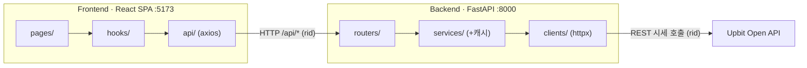

# UPquant

> 업비트(Upbit) KRW 마켓 암호화폐 분석 대시보드

업비트 KRW 마켓의 시세·호가·체결·캔들 데이터를 한 화면에서 탐색하고, 카테고리별 수익률 분석부터 **종목 비교 · 전략 백테스트 · 조건 스크리닝**까지 제공하는 대시보드입니다. 백엔드는 **업비트 Open API(시세, 인증 불필요)** 를 실시간 호출하며, TTL 캐시(stale-while-revalidate) · 부팅 프리페치 · 요청 스로틀로 응답성과 레이트리밋을 함께 관리합니다. 프론트·백엔드·업비트 호출은 **요청 ID(rid)** 로 묶여 한 줄로 추적됩니다.

<p>
  
  
  
  
  
</p>

---

## 목차

- [화면 구성](#화면-구성)
- [기술 스택](#기술-스택)
- [아키텍처](#아키텍처)
- [프로젝트 구조](#프로젝트-구조)
- [시작하기](#시작하기)
- [API 레퍼런스](#api-레퍼런스)
- [데이터 모델](#데이터-모델)
- [설계 노트](#설계-노트)
- [현재 상태 & 로드맵](#현재-상태--로드맵)

---

## 화면 구성

헤더 탭 6개(대시보드·마켓현황·코인목록·비교분석·백테스트·스크리너) + 코인 상세(하위 라우트)로 구성된 SPA입니다. 도움말은 헤더 **? 버튼 → `window.open` 별도 창**입니다.

| 경로 | 페이지 | 설명 | 참고 스타일 |
|------|--------|------|------------|
| `/` | **Dashboard** (대시보드) | KPI 카드 · 공포·탐욕 게이지 · 시장 지배력 도넛 · 급등/급락 피드 · 카테고리 누적수익률(월/분기/년) · 상관관계 히트맵 · 월별 수익률 히트맵 · 리스크-수익 산점도 | Finviz |
| `/market` | **Market** (마켓 현황) | 미니 차트 카드 · 52주 신고가/신저가 배지 · 상승률/하락률 테이블 · 거래대금 TOP5 · 거래대금 트리맵 | — |
| `/coins` | **CoinList** (코인 목록) | 검색 · 필터 탭 · 3단계 정렬 · 즐겨찾기(localStorage) · 52주 위치 바 · 스파크라인 | CoinGecko |
| `/coins/:market` | **CoinDetail** (코인 상세) | 캔들차트(분/일/주/월 + MA·볼린저·RSI 토글) · 호가창 · 체결 내역 · 타 종목 상관관계 | Upbit |
| `/compare` | **Compare** (비교 분석) | 최대 5종목 90일 누적 등락률 겹쳐 비교 (헤더 탭, 진입 시 BTC·ETH·XRP 기본 선택) | — |
| `/backtest` | **Backtest** (백테스트) | MA크로스/RSI 전략·자산곡선·MDD·승률 (헤더 탭, 진입 시 BTC·MA크로스 자동 실행) | — |
| `/screener` | **Screener** (스크리너) | 다중조건·프리셋 스크리닝 (헤더 탭, 진입 시 '급등주' 프리셋 자동 실행) | — |
| `/help` | **Help** (도움말) | 페이지별 기능·동작·이동 경로 안내. 헤더 **? 도움말** 클릭 시 `window.open` 별도 창으로 표시 | — |

---

## 기술 스택

### Backend (Python)

| 라이브러리 | 용도 |
|-----------|------|
| **FastAPI** | REST API 서버 · 인바운드 로깅 미들웨어 |
| **httpx** | 업비트 REST 클라이언트 (동기 + 전역 스로틀 · 429 재시도 · `event_hooks` 로깅) |
| **pydantic / pydantic-settings** | 응답 스키마(DTO) · 환경설정 |
| **uvicorn** | ASGI 서버 |

> 외부 의존성 없는 인메모리 TTL 캐시(`core/cache.py`, stale-while-revalidate)와 `contextvars` 기반 요청 ID 로깅(`core/logging.py`)을 자체 구현했습니다.

### Frontend (Node)

| 라이브러리 | 용도 |
|-----------|------|
| **React 19 + Vite** | UI 프레임워크 · 번들러 (JavaScript) |
| **react-router-dom v7** | 클라이언트 사이드 라우팅 |
| **axios** | HTTP 클라이언트 |
| **recharts v3** | 분석 차트 (라인 · 산점도 · 트리맵 · 스파크라인) |
| **lightweight-charts v5** | 캔들차트 (CoinDetail) |
| **Tailwind CSS v4** | 스타일링 (`@tailwindcss/vite`) |

---

## 아키텍처

프론트엔드(SPA)와 백엔드(REST API)가 분리된 모노레포이며, 각 레이어는 단방향으로 의존합니다.



**Backend 레이어** — Spring과 유사한 계층 구조

```
routers/   ← HTTP 진입점          (≈ @RestController)
   ↓
services/  ← 비즈니스 로직 + 캐싱   (≈ @Service)  ※ 업비트 응답을 가공·캐시
   ↓
clients/   ← 외부 API 호출 래퍼    (≈ @Repository)  ※ 스로틀·재시도·로깅
```

**관측성(Observability)** — 프론트 axios 인터셉터 → 백엔드 미들웨어 → 업비트 `event_hook`이 모두 동일한 **요청 ID(rid)** 로 로깅됩니다. 백엔드가 `X-Request-Id` 헤더로 rid를 내려주며, Spring의 MDC처럼 한 요청의 전 구간을 grep 한 번으로 추적할 수 있습니다.

**Frontend 레이어**

```
pages/     ← 라우트별 화면
   ↓
hooks/     ← 데이터 페칭 + 상태 관리
   ↓
api/       ← axios HTTP 호출
```

---

## 프로젝트 구조

```
up-quant/
├── backend/                       # FastAPI 서버
│   ├── app/
│   │   ├── main.py                # 앱 진입점 · CORS · 인바운드 로깅 미들웨어 · 부팅 프리페치 · /health
│   │   ├── core/
│   │   │   ├── config.py          # 환경설정 · 마켓 유니버스/카테고리 · 캐시 TTL
│   │   │   ├── cache.py           # 인메모리 TTL 캐시 (stale-while-revalidate · single-flight)
│   │   │   └── logging.py         # 요청 ID(rid) contextvar + 공통 로깅 포맷
│   │   ├── clients/
│   │   │   └── upbit_rest.py      # 업비트 REST 클라이언트 (httpx 동기 · 스로틀 · 429 재시도 · event_hook 로깅)
│   │   ├── schemas/               # Pydantic 응답 모델
│   │   │   ├── market.py          # Ticker · MarketSummary · Orderbook · Trade
│   │   │   ├── candle.py          # CandleItem
│   │   │   ├── analysis.py        # CategoryMonthly · CoinStat
│   │   │   └── backtest.py        # EquityPoint · TradeRecord · BacktestMetrics · BacktestResult
│   │   ├── services/              # 비즈니스 로직 (업비트 응답 가공 + 캐싱)
│   │   │   ├── market_service.py  # 현재가·한글명·호가·체결·요약·52주·스파크라인
│   │   │   ├── candle_service.py  # 캔들 (일봉 200개 캐시 후 슬라이스 공유 · >200 페이지네이션)
│   │   │   ├── analysis_service.py # 변동성·1개월수익률·상관관계·섹터 수익률 (월봉 동일가중, 실데이터)
│   │   │   └── backtest_service.py # MA 크로스 · RSI 전략, SMA/RSI/MDD 계산
│   │   └── routers/               # HTTP 엔드포인트
│   │       ├── markets.py
│   │       ├── candles.py
│   │       ├── analysis.py
│   │       └── backtest.py
│   └── requirements.txt
├── frontend/                      # React + Vite SPA
│   ├── src/
│   │   ├── main.jsx               # 진입점
│   │   ├── App.jsx                # 라우트 정의
│   │   ├── index.css              # Tailwind 엔트리 + @theme 색 토큰(업비트 블루) · Pretendard 폰트 · 페이지 배경
│   │   ├── theme.js               # 구분용 색 팔레트 (SERIES · DOM_COLORS) — 시리즈/섹터 색 한 곳 관리
│   │   ├── api/                   # axios 호출 래퍼
│   │   │   ├── client.js          # axios 인스턴스 (baseURL) + 요청/응답 로깅 인터셉터
│   │   │   ├── markets.js
│   │   │   ├── candles.js
│   │   │   ├── analysis.js
│   │   │   └── backtest.js
│   │   ├── hooks/                 # 데이터 페칭 훅
│   │   │   ├── useTickers.js
│   │   │   ├── useCandles.js
│   │   │   └── useAnalysis.js
│   │   ├── components/
│   │   │   ├── ui/                # 공용 UI (PageHeader · Spinner · Card/CardHeader · StatCard)
│   │   │   ├── InfoTooltip.jsx    # 제목 옆 ? 호버 안내 툴팁 (부가기능 공용)
│   │   │   └── layout/            # Header · Layout
│   │   └── pages/                 # 라우트별 페이지
│   │       ├── Dashboard.jsx
│   │       ├── Market.jsx
│   │       ├── CoinList.jsx
│   │       ├── CoinDetail.jsx
│   │       ├── Compare.jsx        # 비교 분석 (헤더 탭)
│   │       ├── Backtest.jsx       # 백테스트  (헤더 탭)
│   │       ├── Screener.jsx       # 스크리너  (헤더 탭)
│   │       └── Help.jsx           # 사용 설명서 (별도 창)
│   ├── index.html
│   ├── vite.config.js
│   ├── eslint.config.js
│   └── package.json
└── references/                    # 기획서 · API 명세 · 엔지니어링 노트 · 레퍼런스 이미지
```

---

## 시작하기

### 사전 요구사항

- **Python** 3.11+
- **Node.js** 18+ (권장: 20+)

### Backend

```powershell
cd backend
python -m venv .venv
.\.venv\Scripts\Activate.ps1
pip install -r requirements.txt
fastapi dev app/main.py
```

→ API 서버: <http://localhost:8000>
→ Swagger 문서: <http://localhost:8000/docs>

> macOS / Linux는 `source .venv/bin/activate`로 가상환경을 활성화합니다.

### Frontend

```bash
cd frontend
npm install
npm run dev
```

→ 개발 서버: <http://localhost:5173>

> 프론트엔드는 `http://localhost:8000`을 백엔드로 호출하며, 백엔드 CORS는 `http://localhost:5173`을 허용합니다. 두 서버를 함께 실행해야 합니다.

#### 사용 가능한 스크립트 (frontend)

| 명령 | 설명 |
|------|------|
| `npm run dev` | 개발 서버 (HMR) |
| `npm run build` | 프로덕션 빌드 |
| `npm run preview` | 빌드 결과 미리보기 |
| `npm run lint` | ESLint 검사 |

---

## API 레퍼런스

기본 URL: `http://localhost:8000` · 전 엔드포인트 인증 불필요 (공개 시세)

> 응답은 업비트 Open API를 호출해 생성하며 TTL 캐시(stale-while-revalidate)로 제공됩니다. 모든 응답에 추적용 `X-Request-Id` 헤더가 포함됩니다.

### Health

| Method | Path | 설명 |
|--------|------|------|
| `GET` | `/health` | 헬스 체크 → `{ "status": "ok" }` |

### Markets — `/api/markets`

| Method | Path | 응답 모델 | 설명 |
|--------|------|-----------|------|
| `GET` | `/tickers` | `Ticker[]` | 전체 코인 현재가 목록 |
| `GET` | `/tickers/{market}` | `Ticker` | 단일 코인 현재가 (없으면 404) |
| `GET` | `/summary` | `MarketSummary` | 시장 요약 (거래대금·상승/하락 수·BTC 도미넌스) |
| `GET` | `/orderbook/{market}` | `Orderbook` | 호가창 (매도/매수 호가) |
| `GET` | `/trades/{market}` | `Trade[]` | 최근 체결 내역 (30건) |

### Candles — `/api/candles`

| Method | Path | 쿼리 파라미터 | 응답 모델 | 설명 |
|--------|------|--------------|-----------|------|
| `GET` | `/{market}` | `interval=days` · `count=60` | `CandleItem[]` | 캔들 데이터 (`interval`: `minutes/{1\|3\|5\|15\|30\|60\|240}` \| `days` \| `weeks` \| `months`) |

### Analysis — `/api/analysis`

| Method | Path | 응답 모델 | 설명 |
|--------|------|-----------|------|
| `GET` | `/category/monthly` | `CategoryReturns` | 섹터별 월간 수익률 (최근 6개월, 월봉 동일가중) |
| `GET` | `/category/cumulative` | `CategoryReturns` | 섹터별 누적 수익률 (`period=월\|분기\|년`) |
| `GET` | `/coins` | `CoinStat[]` | 코인별 변동성·1개월 수익률 (리스크-수익 산점도용) |
| `GET` | `/correlation/{market}` | `CorrelationItem[]` | 지정 종목과 타 종목의 60일 종가 피어슨 상관관계 (내림차순) |

### Backtest — `/api/backtest`

일봉 캔들 기준 전략 시뮬레이션. 초기 자본 100으로 단일 종목 롱 포지션을 매매합니다.

| Method | Path | 쿼리 파라미터 | 응답 모델 | 설명 |
|--------|------|--------------|-----------|------|
| `GET` | `/ma-cross` | `market=KRW-BTC` · `fast=5` · `slow=20` · `count=200` | `BacktestResult` | 이동평균 골든/데드크로스 전략 |
| `GET` | `/rsi` | `market=KRW-BTC` · `period=14` · `oversold=30` · `overbought=70` · `count=200` | `BacktestResult` | RSI 과매도 매수 / 과매수 매도 역추세 전략 |

---

## 데이터 모델

주요 Pydantic 응답 스키마입니다. (`backend/app/schemas/`)

<details>
<summary><b>Ticker</b> — 현재가</summary>

| 필드 | 타입 | 설명 |
|------|------|------|
| `market` | `str` | 마켓 코드 (예: `KRW-BTC`) |
| `korean_name` | `str` | 한글명 |
| `trade_price` | `float` | 현재가 |
| `change` | `str` | `RISE` \| `FALL` \| `EVEN` |
| `change_rate` | `float` | 전일 대비 변동률 |
| `change_price` | `float` | 전일 대비 변동액 |
| `acc_trade_price_24h` | `float` | 24h 누적 거래대금 |
| `high_price` / `low_price` | `float` | 고가 / 저가 |
| `prev_closing_price` | `float` | 전일 종가 |
| `sparkline` | `float[]` | 미니 차트용 가격 배열 |
| `is_52w_high` / `is_52w_low` | `bool` | 52주 신고가 / 신저가 여부 |
| `w52_high` / `w52_low` | `float` | 52주 최고가 / 최저가 |

</details>

<details>
<summary><b>MarketSummary</b> · <b>Orderbook</b> · <b>Trade</b></summary>

```text
MarketSummary { total_volume, up_count, down_count, btc_dominance }
Orderbook     { market, asks: OrderbookUnit[], bids: OrderbookUnit[] }
OrderbookUnit { price, size }
Trade         { timestamp, price, volume, side(BID|ASK) }
```

</details>

<details>
<summary><b>CandleItem</b> · <b>CategoryMonthly</b> · <b>CoinStat</b> · <b>CorrelationItem</b></summary>

```text
CandleItem      { timestamp(ms), open, high, low, close, volume }
CategoryReturns { categories[섹터명…], rows[{ label, <섹터명>: 수익률%, … }] }
CoinStat        { market, korean_name, category(섹터·한글|null), volatility(%), return_1m(%), acc_trade_price_24h }
CorrelationItem { market, korean_name, correlation(-1.0~1.0) }
```

코인은 업비트 데이터랩 '코인 분류' 기준 **5개 섹터**(`스마트 컨트랙트 플랫폼` · `인프라` · `디파이` · `문화/엔터테인먼트` · `밈`)로 분류됩니다.

</details>

<details>
<summary><b>BacktestResult</b> — 백테스트 결과</summary>

```text
BacktestResult  { equity: EquityPoint[], trades: TradeRecord[], metrics: BacktestMetrics }
EquityPoint     { time(s), value }              # 초기 100 기준 포트폴리오 가치
TradeRecord     { time(s), side(BUY|SELL), price, pnl(%) }
BacktestMetrics { total_return(%), mdd(%), win_rate(%), trade_count }
```

</details>

---

## 설계 노트

| 항목 | 선택 | 사유 |
|------|------|------|
| 데이터 소스 | 업비트 시세(Quotation) REST · 인증 불필요 | 계정/거래 권한 없이 시세만 사용 |
| 캐싱 | 인메모리 TTL + stale-while-revalidate + single-flight | 만료 시에도 옛 값 즉시 응답, 갱신은 백그라운드 1스레드만 (콜드·스탬피드 회피) |
| 일봉 캐시 통합 | 종목별 200개 1회 fetch 후 슬라이스 공유 | 스파크라인·통계·상관관계가 캔들을 재호출하지 않음 (상관관계 ~1800ms → ~5ms) |
| 레이트리밋 | 전역 스로틀(~초당 8회) + 429 백오프 재시도 | 시세 API IP 제한(초당 약 10회) 내 버스트 방지 |
| 캐시 워밍 | 부팅 시 **동기** 프리페치(tickers+coin_stats+카테고리 월봉) 후 기동 | 기동 느려지는 대신 첫 사용자도 콜드 없음. 대량 팬아웃은 기동 1회만, 이후 클라이언트는 캐시 히트 (종목별 호가·체결·캔들·상관관계는 호출 수/실시간성 때문에 제외) |
| 관측성 | `contextvars` 기반 rid를 3계층 로그에 주입 + `X-Request-Id` | Spring MDC처럼 요청 전 구간 추적 |
| 마켓 유니버스 | 분석은 KRW 전체(~261종, `USE_ALL_KRW_MARKETS`) | `/market/all` 교집합으로 상장폐지 자동 제외 (예: MATIC → POL) |
| 코인 분류 | 업비트 데이터랩 '코인 분류' 스크랩 (정적 스냅샷 `upbit_sectors.json`, 5섹터) | 시세 API 미제공 → 데이터랩 RSC 1회 스크랩(엔지니어링노트 §12) |
| 카테고리 수익률 | 섹터 소속 종목 월봉 **동일가중 평균**(실데이터) | 시총가중이 이상적이나 실시간 시총 부재로 보류(§14) |
| 라우터 prefix | `/api/markets` 등 플랫 구조 | `api/v1/` 버저닝 생략 |
| 색상 컨벤션 | 상승 = 빨강 / 하락 = 파랑 | 한국 금융 UI 관행 |
| 헤더 색상 | `#093687` 네이비 | 업비트 헤더 톤 매칭 |
| 캔들차트 | lightweight-charts v5 | `addSeries(CandlestickSeries, opts)` API |
| 백테스트 입력 | `candle_service`의 일봉 캔들 재사용 | 별도 데이터 소스 없이 전략 검증 |
| 실시간성 | 현재 HTTP 폴링, WebSocket은 추후 | REST + 캐시로 충분 |

> 업비트 Open API: REST `https://api.upbit.com/v1`, WebSocket `wss://api.upbit.com/websocket/v1`. 공개 시세는 인증 불필요 (REST 분당 약 600회 제한).

### 캐시 동작 (TTL · stale-while-revalidate)

모든 업비트 호출은 예외 없이 `cached(key, ttl, fetch)` 한 곳을 거칩니다. **"무거운 것만 캐싱하고 실시간 건 직접 호출"이 아니라, 전부 캐싱하되 TTL만 다릅니다.** (`core/config.py`)

| 데이터 | TTL | 만료 시 fan-out |
|--------|-----|-----------------|
| 현재가(ticker) | 5s | 1콜 (전 종목 일괄) |
| 호가 · 체결 | 3s | 1콜 |
| 분 · 주 · 월 캔들 | 30s | 1콜 |
| 스파크라인 (1시간봉 24개) | 300s (5분) | **261콜** |
| 일봉 (통계 공용) | 600s (10분) | **261콜** |
| 카테고리 월봉 | 1800s (30분) | **261콜** |
| 마켓목록 · 한글명 | 3600s | 1콜 |

각 키는 3가지 상태로 동작합니다.

- **신선 (TTL 내)** — 업비트를 호출하지 않고 캐시를 즉시 반환.
- **stale (만료)** — **옛 값을 즉시 반환**하고, 갱신은 백그라운드 1스레드만 수행(single-flight). 프론트는 로딩 없이 빠르고, 백엔드 로그에만 fan-out이 보입니다.
- **콜드 (키 없음)** — 동기 fetch(사용자가 대기). 부팅 직후 · 서버 재시작, 또는 프리페치에서 제외된 **종목 상세 첫 방문**(호가·체결·캔들·상관관계)만 해당.

재검증은 **lazy** 합니다 — 주기 타이머가 아니라 **요청이 들어와 stale을 발견했을 때만** 갱신합니다(요청이 없으면 캐시는 stale인 채 방치). 따라서 다른 페이지에서 대시보드로 돌아왔을 때 "부팅처럼 수백 콜"이 도는 것은 **무거운 캐시의 TTL 경계를 넘긴 첫 방문일 때 1회뿐**이며(스파크라인 5분 · 일봉 10분 · 카테고리 월봉 30분), 곧바로 다시 들어가면 캐시 히트라 조용합니다. 부팅(동기 · 대기)과 이후 재검증(비동기 · 무대기)은 같은 콜 수라도 성격이 다릅니다.

---

## 현재 상태 & 로드맵

> ✅ 업비트 시세 Open API 실연동 완료. 카테고리 분류는 업비트 데이터랩 '코인 분류' 스냅샷, 수익률은 실 월봉 집계입니다.

**완료**
- [x] 백엔드 4개 라우터 (markets / candles / analysis / backtest) + 응답 스키마
- [x] **업비트 시세 REST 실연동** — 현재가·캔들(분/일/주/월)·호가·체결·마켓목록·52주 고저
- [x] 인메모리 TTL 캐시(stale-while-revalidate · single-flight) · 부팅 프리페치 · 요청 스로틀 · 429 재시도
- [x] 변동성·1개월 수익률·상관관계·섹터 수익률(월별/누적) — 모두 실 캔들 기반 계산
- [x] MA 크로스 / RSI 백테스트 엔진 (자산 곡선·MDD·승률, 200캔들 초과 페이지네이션)
- [x] 프론트 8개 페이지 (대시보드·마켓·코인목록·코인상세·비교분석·백테스트·스크리너·도움말) + 데이터 페칭 훅
- [x] CoinDetail 캔들 인터벌 탭 (분/일/주/월 + MA·볼린저·RSI 지표 토글)
- [x] rid 기반 3계층 통합 로깅 (axios 인터셉터 · FastAPI 미들웨어 · httpx event_hook)
- [x] 비교분석 렌더링 개선 — 종목별 캔들 캐싱으로 기존 라인 재요청·재애니메이션 없이 추가만
- [x] 비교분석 Y축 고정(-30~50%)으로 종목 토글 시 라인 개형 유지 + 검색·스크롤 그리드 선택 + 초기화 버튼
- [x] 마켓현황 상승/하락률 테이블 행 전체 클릭 → 코인 상세 이동
- [x] 리스크-수익 분포 — 거래대금 상위 종목 대상(`SCATTER_LIMIT`) · 분포 본체(IQR 펜스)만 산점도 · 색상=1개월 수익률(상승 빨강/하락 파랑) · 극단값 종목은 하단 표로 분리
- [x] 마켓현황 상승률·하락률·거래대금 20위 표 + 시장 현황 트리맵을 거래대금 상위 30(메이저)만 표시
- [x] 코인목록 미니그래프를 1일(1시간봉 24개) 스파크라인으로 변경 (`TTL_SPARKLINE`)
- [x] 스크리너 등락률 스케일 버그 수정(소수→%) + 프리셋 기본값을 유니버스에 맞게 조정
- [x] 더미데이터 사용처 파악 — 카테고리 월간/누적 수익률(예시), 코인↔카테고리 수동 매핑
- [x] 대시보드 카테고리 차트(월별·누적·상관관계)에 "예시" 배지 표기
- [x] 분석 유니버스를 업비트 KRW 마켓 전체(약 261종목)로 확장 (`config.USE_ALL_KRW_MARKETS`, 일봉/스파크라인 캐시 장기화로 부하 억제)

**사용자 요청 (2026-05-25) — 완료**
- [x] **콜드스타트 완화: 부팅 프리페치에 `get_coin_stats()` 추가** — `main.py:_prefetch`가 `get_tickers()`(현재가+스파크라인)에 더해 대시보드가 기다리는 일봉 팬아웃(`get_coin_stats`)까지 함께 워밍. 캐시는 서버 프로세스 전역(인메모리)이라 한 번 워밍되면 이후 모든 클라이언트는 즉시 응답 → **단일 인스턴스 전제** 해결책. (멀티 인스턴스로 스케일아웃하면 인스턴스마다 콜드 → Redis 등 공유 캐시 필요, 별도 보류)
- [x] **마켓현황 상단 4개 카드를 거래대금 상위 4개로 변경** — `Market.jsx`의 `FEATURED` 하드코딩(BTC·ETH·XRP·SOL) 제거 → `byVolume.slice(0, 4)` 동적. 업비트 Open API ticker는 시총을 제공하지 않아(시총은 데이터랩에서 별도 계산) 거래대금 기준이 정답
- [x] **코인목록 정렬 = 거래대금 24h 내림차순 유지(확정)** — 업비트도 동일 기준. 시총순은 Open API 미제공이라 불가, 현재가 정렬은 메이저 척도가 아님 → (A) 거래대금 유지로 확정
- [x] **코인상세 레이아웃 재구성** — 차트(320px 고정)와 호가창(~720px)의 높이 불균형 해소. 차트+호가 카드를 동일 높이(`h-[560px]`)로 묶고, 캔들차트는 `autoSize`로 카드를 채우며, 호가창은 카드 높이 안에서 내부 스크롤
- [x] **비교분석·백테스트·스크리너를 부가기능 허브 새 창으로 분리** — 헤더 '부가기능' 버튼 → `window.open('/tools')`, 새 창(`ToolsHub.jsx`)에서 3개를 탭으로 전환. 메인 헤더 탭은 대시보드·마켓현황·코인목록 3개로 축소
- [x] **헤더 스크롤 고정(sticky)** — `sticky top-0 z-50`
- [x] **마켓현황 트리맵 색상 범례 추가** — 상승(빨강)/하락(파랑) + "칸 크기=거래대금·진할수록 등락폭 큼" 설명 (대시보드 산점도 색상 설명과 동일 취지)
- [x] **스파크라인 변동성 가시화 + 호버 툴팁** — 코인목록·마켓 상위4개 미니차트의 Y축을 `[dataMin, dataMax]`로 타이트하게(0 기준 제거)하여 작은 변동도 보이도록, 호버 시 가격(KRW) 툴팁 표시

**사용자 요청 (2026-05-26) — 완료 (코드/빌드 검증, 브라우저 육안 미검증)**
- [x] **코인목록 1일 스파크라인 호버 툴팁이 그래프를 가리는 문제 수정** — 80×32px 차트에서 커서 추적 툴팁이 그래프를 덮던 것 → 차트 위쪽 바깥 고정(`allowEscapeViewBox`+`position`+`pointerEvents:none`)
- [x] **52주 신고가/신저가 판정 수정** — `현재가 ≥/≤ 52주가`(전수 0개·죽은 기능)에서 업비트 `highest/lowest_52_week_date`가 **오늘(KST) 경신**인지로 변경
- [x] **업비트 코인 분류(섹터) 실데이터화** — 데이터랩 '코인 분류'를 1회 스크랩(`upbit_sectors.json`, 261종 5섹터) → `config.MARKET_CATEGORIES` 교체 → 카테고리 월별/누적 수익률을 섹터 종목 **월봉 동일가중 평균**으로 실데이터화(`analysis_service` 재작성, 더미 제거) → 상관관계 히트맵·산점도 자동 실데이터화 → "예시" 배지를 "업비트 분류" 출처 배지로 대체 → 부팅 프리페치에 카테고리 워밍 추가(엔지니어링노트 §11~16)

**사용자 요청 (2026-05-28) — 완료 (코드/빌드 검증, 브라우저 육안 미검증)**
- [x] **대시보드 정리** — '업비트 분류' 출처 배지 제거 · 시장 지배력 범례 코인명-% 간격 축소 · 공포·탐욕 게이지 라벨 잘림 수정(viewBox 확장) · 24h 총 거래대금 표기를 전체 콤마+KRW(B안)로
- [x] **상관관계 히트맵** 긴 한글 섹터명 세로 줄바꿈 수정 (`whitespace-nowrap` + `overflow-x-auto`)
- [x] **마켓현황** — 52주 신고/신저 배지를 거래대금 상위 30종으로 한정(유동성 낮은 잡코인 신저가 노이즈 제거) · 상단 카드 가격 KRW 표기 · 거래대금 상위 표기 B안 통일 · 트리맵 작은 칸 폰트 동적 스케일
- [x] **코인목록** 상단 요약 4개 카드 제거 (대시보드 KPI와 구조 중복 — 총거래대금·BTC도미넌스 동일)
- [x] 캐싱 동작(TTL·SWR·lazy 재검증) 정보를 "설계 노트 → 캐시 동작" 섹션에 정리
- [x] **부가기능 헤더 탭 복귀** — 별도 창(`/tools`·ToolsHub) 제거 → 비교·백테스트·스크리너를 헤더 탭(총 6탭)·Layout 라우트로 환원. 진입 즉시 결과(비교 BTC·ETH·XRP / 백테스트 BTC·MA크로스 / 스크리너 급등주) + `?` 안내 툴팁(`InfoTooltip`)
- [x] **도움말 정리** — 기능 행 태그 세로 쪼개짐(`표→시`) 수정(flex-shrink), 상단 범례 균등 그리드, stale 텍스트(7일→1일·더미→실데이터·52주 상위30) 정정
- [x] **대시보드 상관관계 좌측 카테고리 열 폭**을 월별 수익률 표와 통일(`w-40`)

**사용자 요청 (2026-05-29) — UI 업비트 톤 대개편 + 콘텐츠 재배치 — 완료 (빌드 검증, 브라우저 육안 미검증)**
- [x] **액센트 업비트 블루화** — 전 페이지 `indigo`(보라빛) → `brand`(업비트 블루 `#1763b6`, 네이비 `#093687`). 색 토큰을 `index.css` `@theme`로 정의
- [x] **전반 톤** — 페이지 배경 옅은 회색(`bg-gray-50`)·카드 라운드 완화(`rounded-md`)·본문 폰트 Pretendard
- [x] **로고/아이콘** — 헤더는 흰색 기울임꼴 워드마크 `UPquant`(원형 아이콘 제거), favicon은 파란 원+흰 기울임 "UP", 헤더 탭 글씨 볼드
- [x] **구분용 색 팔레트 통일** — `src/theme.js`(`SERIES`·`DOM_COLORS`)로 모아 Dashboard·Compare가 import (튀던 indigo/emerald/violet 정리)
- [x] **공용 컴포넌트 토대** — `components/ui/`(PageHeader·Spinner·Card·StatCard), PageHeader를 전 페이지 상단에 적용
- [x] **콘텐츠 재배치** — 대시보드 `누적→월별→상관`(원천→파생) · 마켓 "시장 현황"→"거래대금 비중 지도"·주요종목 "거래대금 상위" 라벨

**다음 작업 (기존)**
- [x] **실제 화면 검증(정적)** — 2026-05-25 Edge headless 스크린샷으로 확인: 거래대금 정렬(코인목록 ↓·쑨→온도→BTC순) · 마켓 상단4개=거래대금 상위 · 코인상세 차트/호가 높이 균형(autoSize) · 스파크라인 변동성 · 트리맵 색상 범례 · 부가기능 허브(`/tools`) 탭.
- [x] **UI 업비트 톤으로 개선** (색상·헤더마크·아이콘) — Phase 15 완료 (위 2026-05-29 블록)
  - [x] **구분용 색 팔레트 통일** — `src/theme.js`(`SERIES`·`DOM_COLORS`)로 통일, Dashboard·Compare import
- [ ] **ESLint `react-hooks/set-state-in-effect` 5건 해결** — 데이터 페칭 훅·Compare.jsx의 effect 내 `setLoading(true)` 패턴(사전 존재 이슈)
- [ ] WebSocket 실시간 시세 중계 (FastAPI WS → 프론트 Context)
- [x] **카테고리 데이터 실데이터화 + 분류 적용** (2026-05-26) — 업비트 데이터랩 '코인 분류' 스크랩으로 분류 소스 확정(수동 매핑·외부 API 대신), 월봉 동일가중 평균으로 월별/누적 실데이터화, 상관관계 히트맵 자동 실데이터화, "예시" 배지 제거
  - [ ] (잔여) 리스크-수익 산점도 색상을 섹터별로 반영(현재는 1개월 수익률 색상) · 누적 변동성 드래그 표현 개선 · 분류 스냅샷 갱신 자동화
- [ ] 에러/로딩 상태 UI 개선

**의도적으로 보류**: Redis(분산 캐시) · TypeScript 마이그레이션 · 테스트 코드 · 다크모드 · 배포 설정
